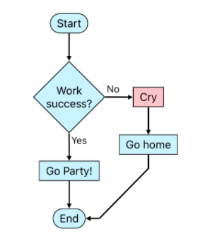

# SwiftFlow
🚧 Work in progress. 🚧

## Intended Features
- allow SPACE! in title of non-id boxes (nodes)
- compared to mermaid js
  - syntax is closer to the output than simply declaring all the links
  - allow new line character, no `<br />`
  - shorter arrow sign, e.g. `->` instead of `-->`
  - `id` comes *after* `name`
  - better loop back over old boxes
- link (arrow)
  - has annotation
  - can specify preferred arrow direction (up, down, left, right, diagonal?)
- box 
  - types: [] rectangle, {} pill, <> diamond, () circle, // slanted, etc.
  - allow multiline text
- support bold/italic text
- support live editing = Xcode playground + Autolayout. SwiftUI live preview is faster but layout is less flexible.
- can show error = Xcode playground

## Example

### Input
```
swiftflow
  () Start
  v
  [] API Client receives responses
  v
  <> Success?
  -YES-> Handle success :: result_yes, Direction.right
  -NO-> Handle failure :: result_no

  result_yes
  v
  [] Print Yay

  result_no
  v
  [] Print Cry

  vv
  () End
  ```
  
### Output

