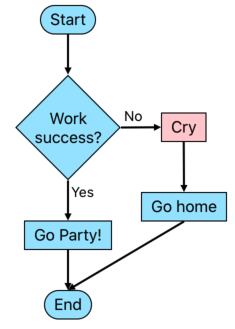

# SwiftFlow
🚧 Work in progress. 🚧

## Intended Features
- allow SPACE! in title of non-id boxes (nodes)
- compared to mermaid js
  - syntax is closer to the output than simply declaring all the links
  - allow new line character, no `<br />`
  - shorter arrow sign, e.g. `->` instead of `-->`
  - `id` comes *after* `name`
  - better loop back over old boxes
- link (arrow)
  - has annotation
  - can specify preferred arrow direction (up, down, left, right, diagonal?)
- box 
  - types: [] rectangle, () pill, <> diamond, // slanted, etc.
  - allow multiline text
- support bold/italic text
- support live editing = Xcode playground + Autolayout. SwiftUI live preview is faster but layout is less flexible.
- can show error = Xcode playground

## Example

### Input Swift code
```swift
var graph = Graph()

var blueBoxConfig = BoxConfig.default
blueBoxConfig.backgroundColor = UIColor(hex: "9EE5FF")!
graph.boxConfig = blueBoxConfig

var redBoxConfig = BoxConfig.default
redBoxConfig.backgroundColor = UIColor(hex: "FFCCD0")!

graph.addFlow([
  Box(shape: .pill, title: "Start"),
  Arrow(direction: .down),
  Box(shape: .diamond, title: "Work\nsuccess?", id: "success"),
  Arrow(direction: .down, title: "Yes"),
  Box(shape: .rect, title: "Go Party!"),
  Arrow(direction: .down),
  Box(shape: .pill, title: "End", id: "end"),
])

graph.addFlow([
  BoxShortcut(id: "success"),
  Arrow(direction: .right, title: "No"),
  Box(shape: .rect, title: "Cry", config: redBoxConfig),
  Arrow(direction: .down, extraSpace: 10),
  Box(shape: .rect, title: "Go home"),
  Arrow(direction: .down),
  BoxShortcut(id: "end"),
])
```
  
### Output Flowchart


### Notes
- I know the SwiftFlow name conflicts with https://github.com/Swift-Kit/Swift-Flow , but I don't care :P.

## Extra feature ideas

These below are just just ideas. 💡

### String format

For those not familiar with Swift language, strings can be used to create the flowchart as well, similar to markdown format.

```swiftflow
 -----------------
 Legend:
 [], <>, () = box shape
 :: = box shortcut
 v  = arrow down
 >  = arrow right
 -----------------

 () Start
 v
 <> Work\nSuccess? :: success
 v Yes
 [] Go party!
 v
 () End :: end

 :: success
 > No
 [] Cry
 v
 [] Go home
 v
 :: end
```
